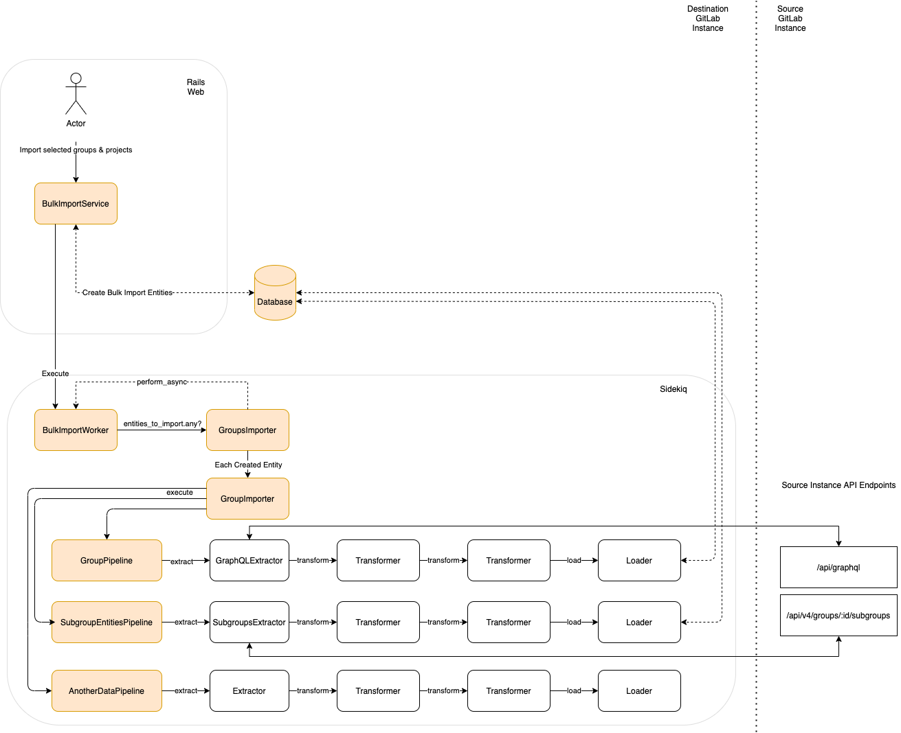

# GitLab Group Migration

[Introduced](https://gitlab.com/groups/gitlab-org/-/epics/2771) in GitLab 13.7.

WARNING:
This feature is [under construction](https://gitlab.com/groups/gitlab-org/-/epics/2771) and its API/Architecture might change in the future.

GitLab Group Migration is the evolution of Project and Group Import functionality. The
goal is to have an easier way to the user migrate a whole Group, including
Projects, from one GitLab instance to another.

## Design decisions

### Overview

The following architectural diagram illustrates how the Group Migration
works with a set of [ETL](#etl) Pipelines leveraging from the current [GitLab APIs](#api).

### [ETL](https://www.ibm.com/cloud/learn/etl)

<!-- Direct quote from the IBM URL link -->

> ETL, for extract, transform and load, is a data integration process that
> combines data from multiple data sources into a single, consistent data store
> that is loaded into a data warehouse or other target system.

Using ETL architecture makes the code more explicit and easier to follow, test and extend. The
idea is to have one ETL pipeline for each relation to be imported.

### API

The current [Project](../user/project/settings/import_export.md) and [Group](../user/group/settings/import_export.md) Import are file based, so they require an export
step to generate the file to be imported.

GitLab Group migration leverages on [GitLab API](../api/README.md) to speed the migration.

And, because we're on the road to [GraphQL](../api/README.md#graphql-api),
GitLab Group Migration will be contributing towards to expand the GraphQL API coverage, which benefits both GitLab
and its users.

### Namespace

The migration process starts with the creation of a [`BulkImport`](https://gitlab.com/gitlab-org/gitlab/-/blob/master/app/models/bulk_import.rb)
record to keep track of the migration. From there all the code related to the
GitLab Group Migration can be found under the new `BulkImports` namespace in all the application layers.
