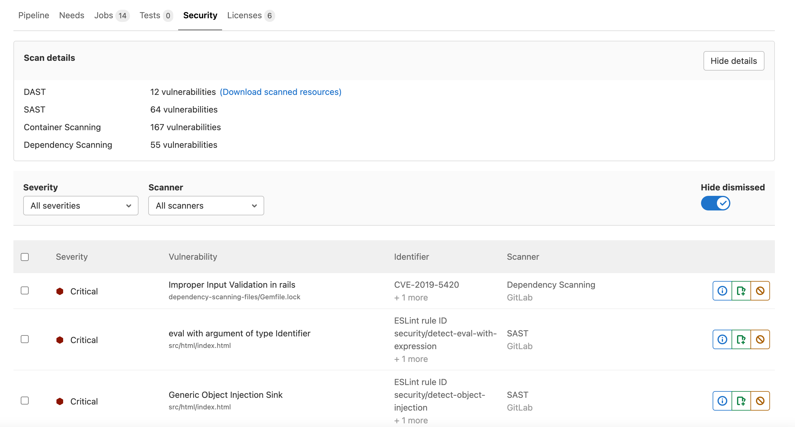
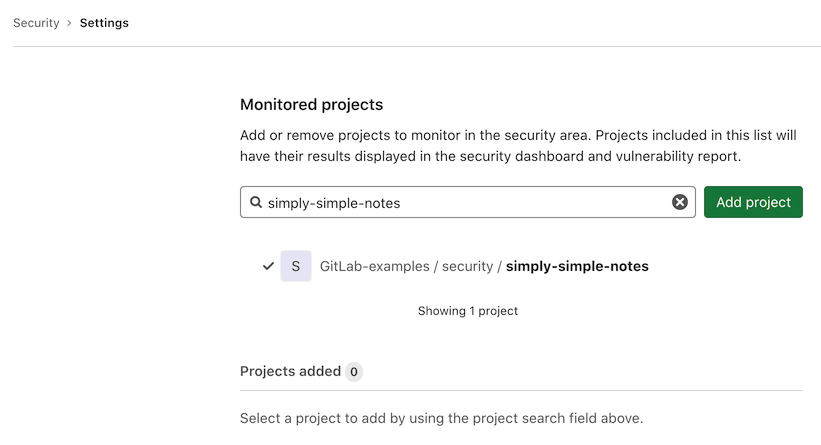

# GitLab Security Dashboards and Security Center **(ULTIMATE)**

GitLab provides a comprehensive set of features for viewing and managing vulnerabilities:

- Security dashboards: An overview of the security status in your personal [Security Center](#security-center), [groups](#group-security-dashboard), and
  [projects](#project-security-dashboard).
- [Vulnerability reports](../vulnerability_report/index.md): Detailed lists of all vulnerabilities for the Security Center, group, project, or
  pipeline. This is where you triage and manage vulnerabilities.
- [Security Center](#security-center): A dedicated area for personalized vulnerability management. This
  includes a security dashboard, vulnerability report, and settings.

You can also drill down into a vulnerability and get extra information on the
[Vulnerability Page](../vulnerabilities/index.md). This view includes the project it
comes from, any related file(s), and metadata that helps you analyze the risk it poses.
You can also confirm, dismiss, or resolve a vulnerability, create an issue for it,
and in some cases, generate a merge request to fix the vulnerability.

To benefit from these features, you must first configure one of the
[security scanners](../index.md).

## Supported reports

The security dashboard and vulnerability report displays information about vulnerabilities detected by scanners such as:

- [Container Scanning](../container_scanning/index.md)
- [Dynamic Application Security Testing](../dast/index.md)
- [Dependency Scanning](../dependency_scanning/index.md)
- [Static Application Security Testing](../sast/index.md)
- And [others](../index.md#security-scanning-tools)!

## Prerequisites

1. At least one project inside a group must be configured with at least one of
   the [supported reports](#supported-reports).
1. The configured jobs must use the [new `reports` syntax](../../../ci/yaml/README.md#artifactsreports).
1. [GitLab Runner](https://docs.gitlab.com/runner/) 11.5 or newer must be used.
   If you're using the shared runners on GitLab.com, this is already the case.

## Pipeline Security

> [Introduced](https://gitlab.com/gitlab-org/gitlab/-/issues/13496) in [GitLab Ultimate](https://about.gitlab.com/pricing/) 12.3.

At the pipeline level, the Security section displays the vulnerabilities present in the branch of
the project the pipeline ran against.

Visit the page for any pipeline that ran any of the [supported reports](#supported-reports). To view
the pipeline's security findings, select the **Security** tab when viewing the pipeline.

A pipeline consists of multiple jobs, including SAST and DAST scanning. If any job fails to finish
for any reason, the security dashboard doesn't show SAST scanner output. For example, if the SAST
job finishes but the DAST job fails, the security dashboard doesn't show SAST results. On failure,
the analyzer outputs an
[exit code](../../../development/integrations/secure.md#exit-code).

### Scan details

> [Introduced](https://gitlab.com/groups/gitlab-org/-/epics/3728) in [GitLab Ultimate](https://about.gitlab.com/pricing/) 13.10.

The **Scan details** section lists the scans run in the pipeline and the total number of
vulnerabilities per scan. For the DAST scan, select **Download scanned resources** to download a
CSV file containing details of the resources scanned.

## Project Security Dashboard

> - [Introduced](https://gitlab.com/gitlab-org/gitlab/-/issues/235558) in GitLab 13.6.
> - [Introduced](https://gitlab.com/gitlab-org/gitlab/-/issues/285476) in GitLab 13.10, options to zoom in on a date range, and download the vulnerabilities chart.
> - [Introduced](https://gitlab.com/gitlab-org/gitlab/-/issues/285477) in GitLab 13.11, date range slider to visualize data between given dates.

A project's Security Dashboard displays a chart with the total number of vulnerabilities
over time. It updates daily with up to 365 days of historical data. By default,
it shows statistics for all vulnerability severities.

To access the dashboard, from your project's home page go to **Security & Compliance > Security Dashboard**.

### Filter the vulnerabilities chart

To filter the chart by vulnerability severity, select the corresponding legend name.

In the previous example, the chart shows statistics only for vulnerabilities of medium or unknown severity.

### Customize vulnerabilities chart display

To customize the view of the vulnerability chart, you can select:

- A specific time frame by using the time range handles (**{scroll-handle}**).
- A specific area of the chart by using the left-most icon (**{marquee-selection}**) then drag
  across the chart. To reset to the original range, select **Remove Selection** (**{redo}**).

### Download a copy of the vulnerabilities chart

To download an SVG image of the chart, select **Save chart to an image** (**{download}**).

## Group Security Dashboard

> [Introduced](https://gitlab.com/gitlab-org/gitlab/-/issues/6709) in [GitLab Ultimate](https://about.gitlab.com/pricing/) 11.5.

The group Security Dashboard gives an overview of the vulnerabilities found in the default branches of the
projects in a group and its subgroups. Access it by navigating to **Security > Security Dashboard**
after selecting your group. By default, the Security Dashboard displays all detected and confirmed
vulnerabilities. If you don't see the vulnerabilities over time graph, the likely cause is that you
have not selected a group.

Note that the Security Dashboard only shows projects with
[security reports](#supported-reports)
enabled in a group.

There is a timeline chart that shows how many open
vulnerabilities your projects had at various points in time. You can display the vulnerability
trends over a 30, 60, or 90-day time frame (the default is 90 days). Hover over the chart to get
more details about the open vulnerabilities at a specific time. Aggregated data beyond 90 days can be accessed by querying our [VulnerabilitiesCountByDay GraphQL API](../../../api/graphql/reference/index.md#vulnerabilitiescountbyday). This data is retained for 365 days.

Next to the timeline chart is a list of projects, grouped and sorted by the severity of the vulnerability found:

| Grade | Description |
| F | One or more "critical" |
| D | One or more "high" or "unknown" |
| C | One or more "medium" |
| B | One or more "low" |
| A | Zero vulnerabilities |

Projects with no vulnerability tests configured don't appear in the list. Additionally, dismissed
vulnerabilities are excluded.

Navigate to the group's [vulnerability report](../vulnerability_report/index.md) to view the vulnerabilities found.

## Security Center

> [Introduced](https://gitlab.com/groups/gitlab-org/-/epics/3426) in [GitLab Ultimate](https://about.gitlab.com/pricing/) 13.4.

The Security Center is personal space where you manage vulnerabilities across all your projects. It
displays the vulnerabilities present in the default branches of all the projects you configure. It includes
the following:

- The [group security dashboard's](#group-security-dashboard) features.
- A [vulnerability report](../vulnerability_report/index.md).
- A dedicated settings area to configure which projects to display.

To view the Security Center, from the navigation bar at the top of the page, select
**More > Security**.

### Adding projects to the Security Center

To add projects to the Security Center:

1. Click **Settings** in the left navigation bar or click the **Add projects** button.
1. Search for and add one or more projects using the **Search your projects** field.
1. Click the **Add projects** button.

After you add projects, the security dashboard and vulnerability report display the vulnerabilities
found in those projects' default branches.

## Keeping the dashboards up to date

The Security Dashboard displays information from the results of the most recent
security scan on the [default branch](../../project/repository/branches/default.md),
which means that security scans are performed every time the branch is updated.

If the default branch is updated infrequently, scans are run infrequently and the
information on the Security Dashboard can become outdated as new vulnerabilities
are discovered.

To ensure the information on the Security Dashboard is regularly updated,
[configure a scheduled pipeline](../../../ci/pipelines/schedules.md) to run a
daily security scan. This updates the information displayed on the Security
Dashboard regardless of how often the default branch is updated.

That way, reports are created even if no code change happens.

WARNING:
Running Dependency Scanning from a scheduled pipeline might result in false negatives if your
project doesn't have a lock file and isn't configured for Continuous Delivery. A lock file is a file
that lists all transient dependencies and keeps track of their exact versions. The false negative
can occur because the dependency version resolved during the scan might differ from the ones
resolved when your project was built and released, in a previous pipeline. Java projects can't have
lock files. Python projects can have lock files, but GitLab Secure tools don't support them.

## Security scans using Auto DevOps

When using [Auto DevOps](../../../topics/autodevops/index.md), use
[special environment variables](../../../topics/autodevops/customize.md#cicd-variables)
to configure daily security scans.

<!-- ## Troubleshooting

Include any troubleshooting steps that you can foresee. If you know beforehand what issues
one might have when setting this up, or when something is changed, or on upgrading, it's
important to describe those, too. Think of things that may go wrong and include them here.
This is important to minimize requests for support, and to avoid doc comments with
questions that you know someone might ask.

Each scenario can be a third-level heading, e.g. `### Getting error message X`.
If you have none to add when creating a doc, leave this section in place
but commented out to help encourage others to add to it in the future. -->

Read more on how to [address the vulnerabilities](../vulnerabilities/index.md).
