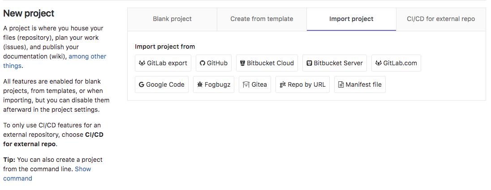
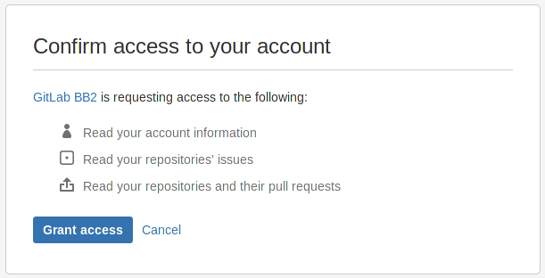

# Import your project from Bitbucket Cloud to GitLab

NOTE:
The Bitbucket Cloud importer works only with Bitbucket.org, not with Bitbucket
Server (aka Stash). If you are trying to import projects from Bitbucket Server, use
[the Bitbucket Server importer](bitbucket_server.md).

Import your projects from Bitbucket Cloud to GitLab with minimal effort.

The Bitbucket importer can import:

- Repository description (GitLab 7.7+)
- Git repository data (GitLab 7.7+)
- Issues (GitLab 7.7+)
- Issue comments (GitLab 8.15+)
- Pull requests (GitLab 8.4+)
- Pull request comments (GitLab 8.15+)
- Milestones (GitLab 8.15+)
- Wiki (GitLab 8.15+)

When importing:

- References to pull requests and issues are preserved (GitLab 8.7+).
- Repository public access is retained. If a repository is private in Bitbucket, it's created as
  private in GitLab as well.

## Requirements

To import your projects from Bitbucket Cloud, the [Bitbucket Cloud integration](../../../integration/bitbucket.md)
must be enabled. Ask your GitLab administrator to enable this if it isn't already enabled.

## How it works

When issues/pull requests are being imported, the Bitbucket importer tries to find
the Bitbucket author/assignee in the GitLab database using the Bitbucket `nickname`.
For this to work, the Bitbucket author/assignee should have signed in beforehand in GitLab
and **associated their Bitbucket account**. Their `nickname` must also match their Bitbucket
`username.`. If the user is not found in the GitLab database, the project creator
(most of the times the current user that started the import process) is set as the author,
but a reference on the issue about the original Bitbucket author is kept.

The importer will create any new namespaces (groups) if they don't exist or in
the case the namespace is taken, the repository will be imported under the user's
namespace that started the import process.

## Import your Bitbucket repositories

1. Sign in to GitLab and go to your dashboard.
1. Click on **New project**.

1. Click on the "Bitbucket Cloud" button.

   

1. Grant GitLab access to your Bitbucket account

   

1. Click on the projects that you'd like to import or **Import all projects**.
   You can also filter projects by name and select the namespace under which
   each project will be imported.

   

## Troubleshooting

If you have more than one Bitbucket account, be sure to sign in to the correct account.
If you've accidentally started the import process with the wrong account, follow these steps:

1. Revoke GitLab access to your Bitbucket account, essentially reversing the process in the following procedure: [Import your Bitbucket repositories](#import-your-bitbucket-repositories).

1. Sign out of the Bitbucket account. Follow the procedure linked from the previous step.
